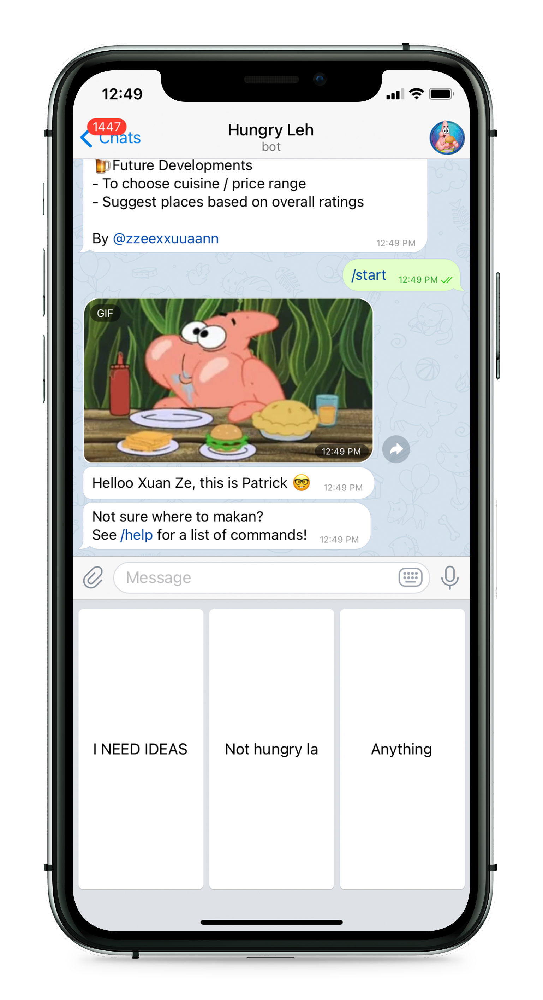
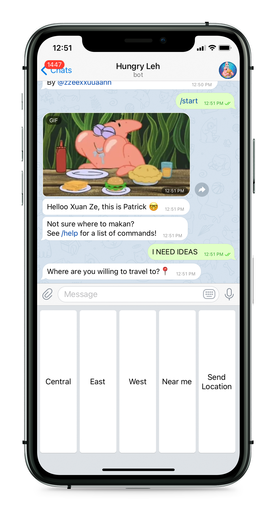
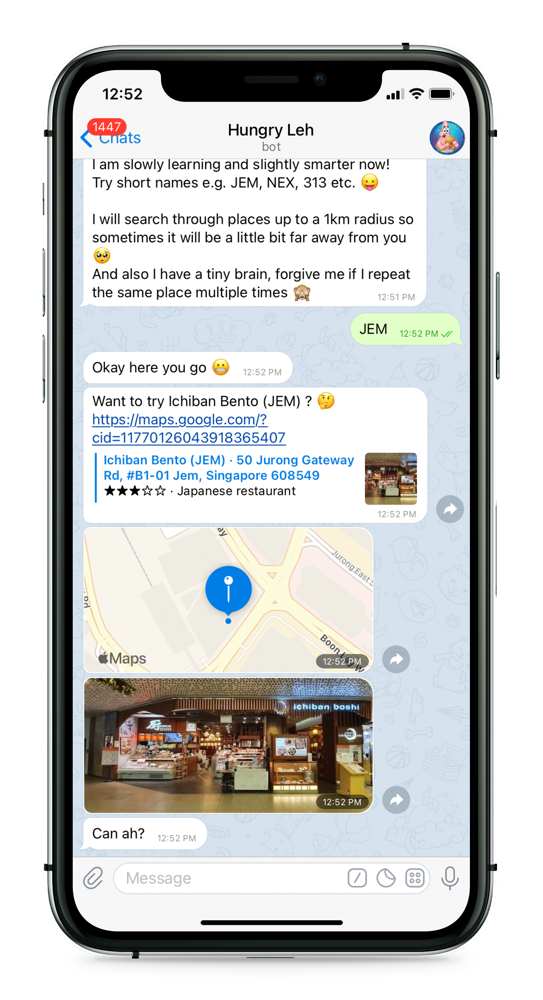
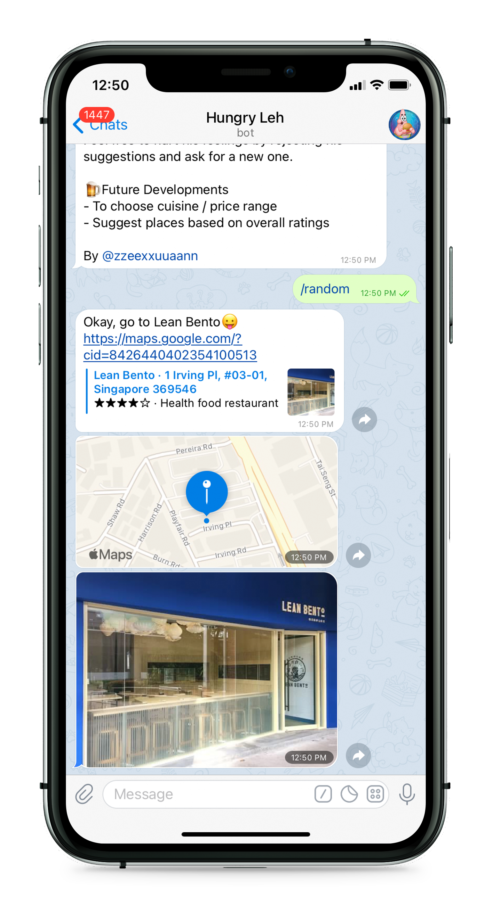

<h1 align = "center">HungryLeh Bot</h1>

 

 

Patrick is here to save the day!

"Your go to resolution to resolve your dating woes when you have no idea of what to eat 😇" - Iris, 2021

***

## What Can I Do
 

* [Start](#Start)

* [Random](#Random)

* [Help](#Help)

* [Exit](#Exit)

* [Packages](#Packages)

* [Developments](#Developments)

***

## Start
<h3>/start</h3> To start chatting with me!
 

<h3>Tell me where do you want to go</h3> and I will do the work :)
 

 
  
   

## Random
<h3>/random</h3> Generate a random place, regardless of location.

## Help
<h3>/help</h3> View the help menu.

## Exit
<h3>/exit</h3> To stop chatting with me :'( 

## Packages
Python Telegram Bot 
https://github.com/python-telegram-bot/python-telegram-bot
 
Python Google Places 
https://github.com/slimkrazy/python-google-places

## Developments
* Addition of SQLite database for multi user
* Enhance query results
* Omit duplicated results