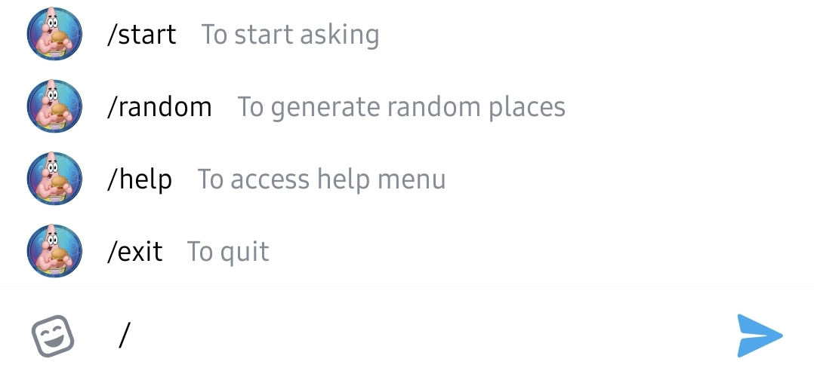

<h1>HungryLeh Bot</h1>

Patrick is here to save the day!  Your go to resolution to resolve your dating woes when you have no idea of what to eat😇

<h2>What Can I Do</h2>

 
<h3>/start</h3> To start chatting with me!
 

<h3>Tell me where do you want to go</h3> and I will do the work :)
 

<h3>/random</h3> Generate a random place, regardless of location.
 

<h3>/help</h3> View the help menu.
<h3>/exit</h3> To stop chatting with me :'( 

 
<h2>Packages</h2>
Python Telegram Bot 
https://github.com/python-telegram-bot/python-telegram-bot 
Python Google Places 
https://github.com/slimkrazy/python-google-places 

 
<h2>Future Developments</h2> 
